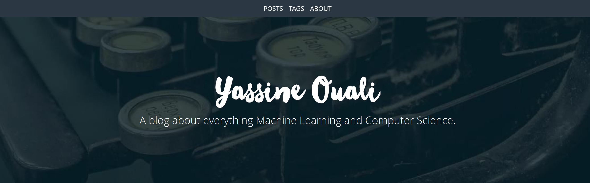

## yassouali.github.io

My personal page / blog, built using [jekyll](https://jekyllrb.com/) and hosted using [github pages](https://pages.github.com/).

If you would like to use this template, you can simply fork this repo and rename it `GHusername.github.io`, or clone this repo, name it the same way, and push it to your account. You'll also need to change the corresponding fields in `_config.yml`, you can also change the 
the logos and backgrounds images in `images`, and then your website should will be up and running, and will live at `GHusername.github.io`.
If you wish, you can also change the HTML and css layouts that are 
defined in `_layouts/`, `_includes/` and `_sass`.

For more details, see the original template this was based on [so-simple-theme](https://github.com/mmistakes/so-simple-theme)

### Contributing:

If you found some errors in the blog posts, please feel free to
create a pull request suggesting a correction. The posts are in `_posts`
with the corresponding date of publication and the post name. Thanks.

#### Acknowledgments:
- [so-simple-theme](https://github.com/mmistakes/so-simple-theme)
- [lil-log.github.io](https://github.com/lilianweng/lil-log)
- [awan.github.io](https://github.com/Awan/awan.github.io)
